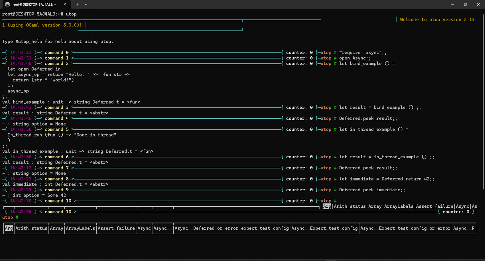
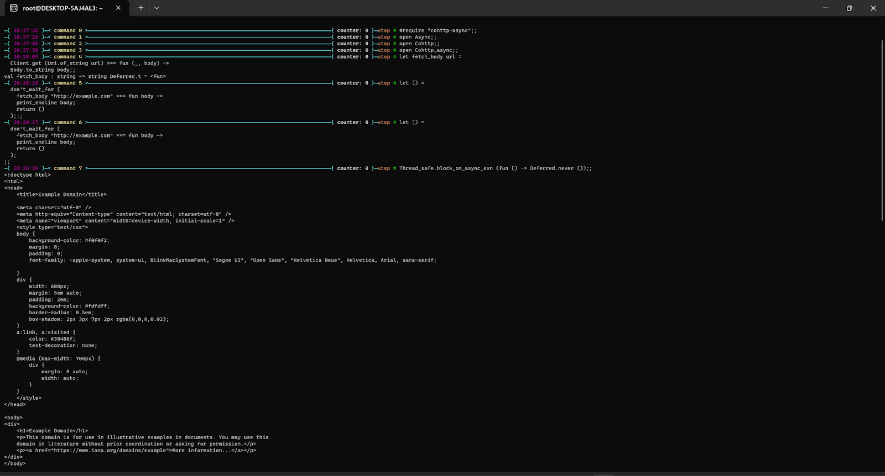
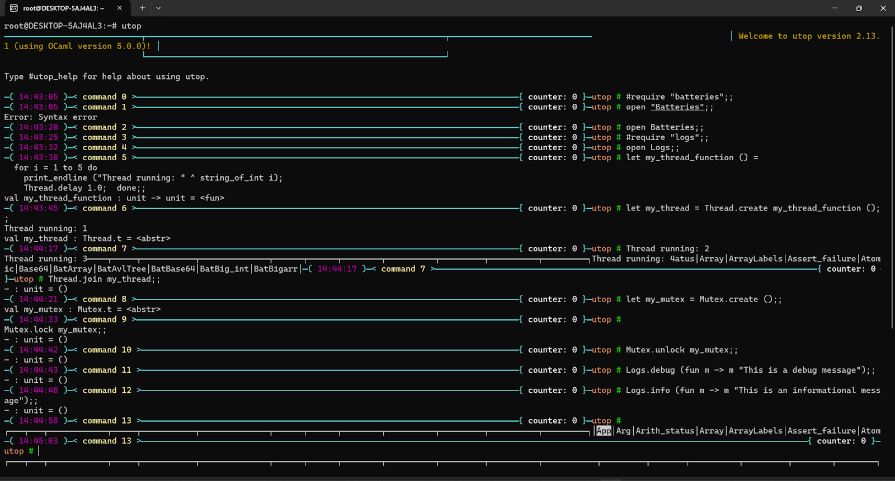

# FPSE Final Project: A Proposal
Jiahao Liu          Jiahui Huang          Qitong Niu  
## Introduction & Purpose
In the ever-evolving landscape of systems administration, the need for efficient and robust tools to monitor and manage Linux-based systems has become increasingly crucial. This proposal outlines our initiative to develop a Linux system monitoring tool using the OCaml programming language. Discussion on useful libraries, a type declaration draft, a mock of use, and a tentative workflow will be covered in the following sessions.

Our primary purpose is to create a versatile, functional, and user-friendly solution that addresses the escalating demand for comprehensive system oversight. For ourselves, we hope this project will help us to grow our experience in developing complete software applications with Ocaml and explore the potential of this functional programming language in the field of computer systems.

## Libraries 
In this section, we will first present the list of libraries that we plan to utilize, key functions in them, together with a brief explanation of their usefulness. Screenshots to show that we’ve verified they really worked will be attached.

| Library   | Key Functions                                                | Usefulness                                                   |
| --------- | ------------------------------------------------------------ | ------------------------------------------------------------ |
| Async     | 1.Async.Deferred.t <br />2.Async.Deferred.bind <br />3.Async.Deferred.return <br />4.Async.In_thread.run <br />5.Async.Clock.after | Async is a concurrent programming library that provides powerful asynchronous programming capabilities. It helps efficiently handle concurrent tasks, which is very important in system monitoring tools where one may need to monitor multiple system metrics at the same time. Async provides Deferred computation (Deferred) and event loops to help manage complex asynchronous tasks. |
| Cohttp    | 1.Cohttp.Client.get <br />2.Cohttp.Client.post <br />3.Cohttp.Client.put <br />4.Cohttp.Response.status<br /> 5.Cohttp.Response.body<br /> | Cohttp is an HTTP client and server library that is useful as the application needs to interact with external services over the HTTP protocol (for example, sending or receiving data). It supports building HTTP requests and parsing responses and can be used with Async or Lwt to provide asynchronous functionality. |
| lwt       | 1.Lwt.return<br />2.Lwt.bind<br />3.Lwt.join<br />4.Lwt.pick<br />5.Lwt.fail | Lwt is a lightweight concurrent programming library that provides the concept of coroutines (lightweight threads). It is similar to Async but provides a different API and concurrency model. Lwt is particularly good at simplifying concurrent I/O operations, which can be particularly useful when monitoring system information. |
| Batteries | 1.IO.with_in<br /> 2.Thread.create <br />3.Thread.join<br /> 4.Mutex.create <br />5.Module:Logging | Batteries is a library that extends the OCaml standard library to provide a large number of utility modules and features related to data structures, concurrency, file processing, and more. If there is a need to use advanced data structures or additional features in your project, Batteries will be used in our project. |

> Table 1: List of Libraries, Functions, and Usefulness 

<br>


> Figure 1. Test for Async Library  
  


<br>



> Figure 2. Test for Cohttp Library

<br>


> Figure 3. Test for Lwt Library

<br>



> Figure 4. Test for Batteries Library


## Modularity

In this section, we will briefly introduce the division of functionality among the main modules. 

On program start, the data collection module (Collector) periodically collects system information from the `/proc` filesystem, such as `/proc/stat`, `/proc/meminfo`, `/proc/[pid]/stat`, which contains information about  CPU, memory, and process details. Then, the data parsing module (Parser) parses the raw data collected into an internal data structure. After that, the data processing module (Processor) will process the parsed data to calculate metrics like CPU and memory usage. These modules lay a solid foundation for the core purpose of our application.

For specific module type declarations, please refer to .mli files in the ./src directory.

## Mock of Use

This section provides a mock of the use of our application by showing the command to run the executable and the corresponding output. As a command line executable, the monitor tool does not necessarily require any arguments. It should run like the following:

```bash
$ ./sysinfo.exe
```
### Tentative Output

```bash
load average: 1.50 1.01 0.71
Tasks: 90 total, 1 running, 89 sleeping
%CPU: 0.1 user, 0.1 system, 99.8 idle
MiB Mem: 4096.0 total, 2000.0 free, 1500.0 used, 596.0 buff/cache
Mib Swap: 1024.0 total, 1024.0 free, 0.0 used

PID		    %CPU	      %MEM	    COMMAND	    STATUS
3005		0.7           0.8		top		    running
1234		1.2           3.4		systemd	    sleeping
...
```

The running statistics get periodically updated to show the current status of the machine. Please note that this is just a rough draft to show how our application will work on the client side. We will put more effort into having a more informative and clear output for the user.

## Work Flow & Division of Labor

This section introduces our planned implementation order for features.

As previously noted, the core of our application are data collector, parser, and processor. While the names and functionalities of these three main modules indicate a sequential order, our current plan is that, after coordinating data input/output formats, each of the three team members will take charge of one of the three modules separately. 

Following the successful delivery of the required statistics in the terminal, our next steps will involve collaborative efforts for potential advancements. This includes exploring the possibility of accepting user input and providing more diverse feedback, refining the overall UI design, etc.


